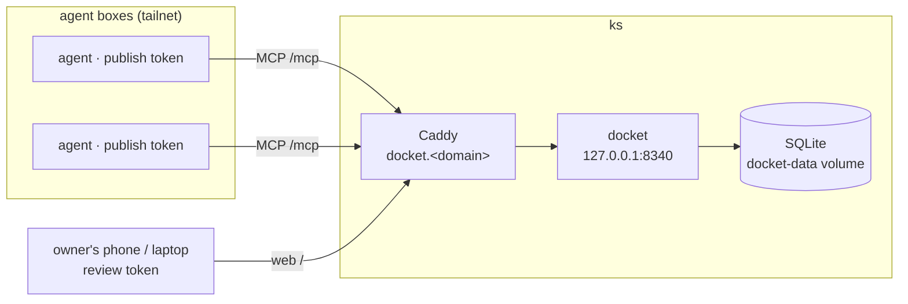

# Docket — Design

A self-hosted backlog MCP any agent can write to. Designed against
[issue #1](https://github.com/Gandalf-Le-Dev/docket/issues/1), deployed with
[Pilot](https://github.com/Gandalf-Le-Dev/pilot).

The problem it solves: agents routinely surface work that is real but out of scope for
the repo they happen to be working in, and today that work has nowhere to go. Docket is
the destination — a single, always-on inbox that any agent on any box can publish to,
and that the owner can review from anywhere, including a phone.

**Shape:** one Go binary. It serves MCP over streamable HTTP for agents, a minimal web
page for the owner, and stores everything in one SQLite file. Deployed as a Pilot
compose service on `ks`, next to `hopbox-docs`.

---

## 1. The name

**Docket.** A docket is a list of matters awaiting attention — filed by many parties,
reviewed by one authority, disposed of one way or the other. That is exactly the shape
of this tool: agents file, the owner adjudicates. It is short, spellable, works as a
hostname (`docket.<domain>`), a binary name (`docket`), and a sentence ("put it on the
docket").

Considered and rejected:

- **Hopper** — the legislative hopper is the perfect metaphor (the box bills are dropped
  into for filing), but it is one typo away from `hopbox` in the same fleet. Two
  services whose names blur together is how the wrong one gets an instruction.
- **Backburner** — right meaning, too long to type, poor hostname.
- **Later** — cute until it appears in prose ("is Later up?").

The MCP *tool* names deliberately do not carry the brand: they are `todo_add`,
`todo_list`, and so on. An agent seeing `todo_add` needs no documentation; an agent
seeing `docket_file` needs a paragraph. Clients namespace tools by server anyway
(`mcp__docket__todo_add`), so nothing collides. The name is for humans; the verbs are
for models.

The repo is renamed `docket` to match — GitHub redirects the old `backlog-mcp` URLs,
remotes, and issue links automatically, so nothing breaks. Binary, service, and repo
all carry the one name.

---

## 2. Principles

1. **Small on purpose.** The value is that it exists everywhere, not that it is a good
   project-management tool. Every feature is judged by whether it serves *file from
   anywhere, review from anywhere* — anything else is scope rot.
2. **Publish is cheap, read is privileged.** Any agent box may add an item. Only the
   owner's surfaces may read, edit, or close. An agent is the least trustworthy thing
   in the fleet, and the backlog is a map of everything the owner cares about — writes
   are safe to hand out, reads are not.
3. **One file of state.** SQLite, WAL mode, one database file. Backup is copying a
   file. There is nothing to shard, migrate, or operate.
4. **Boring over clever.** Numeric ids, RFC 3339 timestamps, `LIKE` search, no FTS, no
   queue, no cache. The dataset is a few thousand rows forever.

---

## 3. Shape



One binary, three surfaces on one port:

| Path       | Surface                          | Auth                          |
|------------|----------------------------------|-------------------------------|
| `/mcp`     | MCP, streamable HTTP, stateless  | Bearer token (publish/review) |
| `/`        | Web UI for review                | Review token, entered once    |
| `/healthz` | Liveness + DB ping, for `pilotd` | None                          |

**Transport.** Streamable HTTP because agents connect over the network from many boxes
and platforms — stdio only works for a co-located client. Docket targets the current
spec revision, **2026-07-28**, which suits it unusually well: that revision removed
protocol-level sessions (`Mcp-Session-Id`), the `initialize` handshake, and the GET
notification stream, so statelessness stopped being a server option and became the
protocol's shape. The server is one POST endpoint; every call is self-contained
(protocol version in the `MCP-Protocol-Version` header and `_meta`), the server
validates the mirrored `Mcp-Method` / `Mcp-Name` headers, implements the mandatory
`server/discover`, and answers every request with a plain JSON object — Docket never
streams and never pushes, so nothing the revision removed is missed. Handshake-era
clients (2025-03-26 through 2025-11-25) still exist on the platforms this must reach;
serving them costs nothing because Docket keeps zero per-client state either way — the
official MCP Go SDK owns the version negotiation, and older clients that expect a
session simply never get a session id, which those revisions permit.

The spec's authorization framework (OAuth 2.1) is more machinery than a
single-operator fleet needs; a static bearer header — the spec requires only that
servers implement *proper authentication*, and every major client supports custom
headers for HTTP servers — is the whole scheme.

**Implementation.** Go, stdlib `net/http`, the official MCP Go SDK,
`modernc.org/sqlite` (pure Go, no CGO, trivial cross-compile), web UI embedded via
`embed.FS`. No JS framework — server-rendered HTML and plain forms. The whole thing is
one to two thousand lines.

---

## 4. The verbs

What each role sees in `tools/list` is filtered by its token: a publish token sees only
`todo_add` and cannot discover the rest exist.

### `todo_add {title, body?, scope?, source?}` — publish + review

Files an item. Returns `{id, duplicate}`.

- `source` is the freeform claim of where this came from — a repo, a conversation, a
  URL. "Who noticed this" is most of the context, so the tool description tells agents
  to always set it.
- The server *also* records which token filed the item (`via`), independently of what
  `source` claims. A compromised box can lie about its source; it cannot lie about
  which token it holds.
- **Dedupe:** if an open item already has the same normalized `title` and `scope`, the
  server returns that item's id with `duplicate: true` instead of inserting. Agents
  retry, and two agents in the same repo notice the same thing; the exact-match rule is
  deliberately dumb so it can never eat a genuinely new item.

### `todo_list {scope?, state?, q?}` — review only

Reads the backlog. `state` defaults to `open`; `q` is a substring match over title and
body. Returns full items — at this scale there is no pagination problem worth solving.

### `todo_get {id}` — review only

One item, for editing workflows.

### `todo_update {id, title?, body?, scope?, state?}` — review only

Edit any field. Setting `state` back to `open` reopens a closed item.

### `todo_close {id, outcome?, reason?}` — review only

`outcome` is `done` (default) or `dropped`. Dropped is distinct from done because "not
going to do this" is a verdict worth remembering — it is the difference between an
empty backlog and an honest one. `reason` is appended to the body.

### `todo_scopes {}` — review only

Distinct scopes in use, each with its open count. Review-only because the scope list is
a table of contents of the owner's life.

**Scope taxonomy: freeform, normalized.** Scopes are trimmed and lowercased on write,
and that is the entire taxonomy. Fixed sets are wrong within a month; freeform rots,
but rot at this scale is twenty minutes of renames — the web UI's scope rename (one
`UPDATE`, exposed as a form action) merges `hopbox` and `hop-box` when it happens.

---

## 5. Storage

SQLite, WAL mode, one file at `/var/lib/docket/docket.db`. Two tables, decided once:

```sql
CREATE TABLE todo (
  id         INTEGER PRIMARY KEY,               -- rowid; "close #42" beats a UUID
  title      TEXT NOT NULL,
  body       TEXT NOT NULL DEFAULT '',
  scope      TEXT NOT NULL DEFAULT '',          -- freeform, normalized lower/trim
  source     TEXT NOT NULL DEFAULT '',          -- claimed origin: repo, chat, url
  via        TEXT NOT NULL,                     -- token name that filed it (server-set)
  state      TEXT NOT NULL DEFAULT 'open'
             CHECK (state IN ('open','done','dropped')),
  created_at TEXT NOT NULL,                     -- RFC 3339 UTC
  updated_at TEXT NOT NULL,
  closed_at  TEXT
);

CREATE INDEX todo_state_scope ON todo (state, scope);

CREATE TABLE token (
  name       TEXT PRIMARY KEY,                  -- doubles as `via` on filed items
  hash       TEXT NOT NULL,                     -- sha256; plaintext never stored
  role       TEXT NOT NULL CHECK (role IN ('publish','review')),
  created_at TEXT NOT NULL,
  revoked_at TEXT
);
```

Closed items are kept forever — a few thousand rows is not a retention problem, and the
done/dropped history is the useful part. No soft-delete beyond `state`; no audit log
beyond `via` and the timestamps.

**Backup:** the deploy mounts the data volume; a nightly `sqlite3 docket.db
".backup docket.bak"` inside the same volume gives whatever already backs up `ks` a
consistent file to pick up. Docket does not grow its own backup system.

---

## 6. Auth

Two roles, many tokens:

- **`publish`** — may call `todo_add`, nothing else. One token *per agent box*, named
  for the box. Per-box rather than shared because revocation should mean unplugging one
  box, not rotating the fleet; and because the token name is what makes `via`
  trustworthy.
- **`review`** — everything. Lives on the owner's own machines and in the web UI
  cookie. One or two of these exist, ever.

Tokens are random 128-bit values, stored hashed, checked as `Authorization: Bearer` on
`/mcp` and as a cookie on the web UI (entered once per device, HttpOnly, Secure).

**Provisioning** is a subcommand on the same binary, run on `ks`:

```
docker compose exec docket docket token new --role publish box-nyc
docker compose exec docket docket token new --role review  phone
docker compose exec docket docket token revoke box-nyc
```

`token new` prints the plaintext exactly once. It is deliberately *not* printed to the
service log on first boot: `pilot logs` redacts credentials it can identify, but
"secrets don't go to logs" should not depend on the redactor winning.

**Guard rails on publish**, because a publish token sits on the least-trusted machine
in the fleet: title ≤ 500 bytes, body ≤ 64 KB, and an in-memory rate limit of 120 adds
per token per hour. A compromised box can make noise; it cannot fill the disk, and
`via` says exactly which box to unplug.

---

## 7. The human surface

MCP is agent-facing; the owner also needs to read this on a phone. The same binary
serves one page:

- Open items grouped by scope, newest first; tap to expand the body and see
  `source`/`via`/dates.
- Per item: **done**, **drop**, and an edit form (title, body, scope).
- An add form at the top — the owner is also allowed to have ideas.
- A state toggle to see done/dropped history, and a rename-scope action.

Server-rendered HTML, plain forms, zero build step. This is the "a day of work" option
from the issue, and it removes the dependency on having an agent client open just to
review. Anything fancier (search UI, keyboard shortcuts, PWA manifest) waits until the
plain page has actually failed at something.

---

## 8. Deployment with Pilot

Docket is a fleet service like any other: a directory in the owner's fleet repo,
deployed to `vps`, fronted by Caddy, health-checked by `pilotd`.

```yaml
# services/docket/service.yaml
name: docket
runtime: compose
hosts: [vps]

# The compose file is the artifact; `output: ["./"]` ships the directory's
# contents into the release.
build:
  output: ["./"]

compose:
  file: compose.yaml

expose:
  domains: [todo.mroc.me]
  upstream: 8340
  verify: true
  # Public on purpose. The first cut of this design closed the route to the
  # tailnet, but the point of the service is that *any* machine can file —
  # hopbox boxes and CI live outside the tailnet — and every request is
  # token-gated anyway: the web page and the tool surface show nothing
  # without one.

health:
  # /healthz answers 200 only if the DB responds to a ping — a wedged SQLite
  # file fails the deploy and rolls back rather than going live dead.
  http:
    url: http://127.0.0.1:8340/healthz
  timeout: 60s

rollout:
  strategy: recreate

alerts:
  # If the backlog is down, agents are silently dropping work again — which is
  # the exact failure this service exists to end. Worth a ping.
  - when: service.down
    for: 2m
    notify: [discord]

  # Somebody edited the host by hand; the next deploy will overwrite it.
  - when: drift.detected
    cooldown: 12h
    notify: [discord]
```

```yaml
# services/docket/compose.yaml
# Pinned project name: the named volume belongs to the compose project, and
# the default project name would come from the release directory, which
# changes every deploy. Pinning it is what makes docket-data survive.
name: docket

services:
  docket:
    image: ghcr.io/gandalf-le-dev/docket:v0.1.0   # pinned; pilot doctor insists
    container_name: docket   # stable name — `docker exec docket …` mints tokens
    restart: unless-stopped
    ports:
      - "127.0.0.1:8340:8340"    # loopback only — Caddy is the only route in
    volumes:
      - docket-data:/var/lib/docket

volumes:
  docket-data:
```

Two Pilot-specific decisions worth calling out:

- **The volume is named, not a relative path.** Pilot releases are immutable numbered
  directories; a `./data:` mount would resolve inside each new release directory, and
  the backlog would quietly reset on every deploy. The named volume belongs to the
  compose project, which is pinned, so it survives releases and rollbacks alike.
- **`recreate` is fine.** The default rollout drops connections for a second or two.
  Nothing here holds a long-lived connection — the MCP surface is stateless on purpose,
  partly so that deploys can stay boring.

**The hostname is decided now: `todo.mroc.me`, one stable name, forever.** The
issue calls this out and it matters more than it looks: hopbox's planned per-box egress
allowlist is default-deny, and if this host is not baked into the default policy, every
agent silently loses the ability to file — the tool's failure mode is exactly the
problem it was built to solve. `todo.mroc.me` goes into hopbox's default allowlist
in the same change that deploys the service.

---

## 9. Agent-side wiring

Each agent box gets the standard HTTP MCP client config:

```json
{
  "mcpServers": {
    "docket": {
      "type": "http",
      "url": "https://todo.mroc.me/mcp",
      "headers": { "Authorization": "Bearer ${DOCKET_TOKEN}" }
    }
  }
}
```

plus one line of standing instruction in the box's agent guidance: *"work that is real
but out of scope for the current repo goes to `todo_add`, with `source` set to where
you noticed it."* The tool description repeats this, so even an agent with no standing
instruction files things sensibly. Baking the config into hopbox's box provisioning is
a hopbox change, tracked there.

---

## 10. Non-goals

Restating the issue's, with the ones this design adds:

- **Not a project manager.** No sprints, assignees, dependencies, boards, or due dates.
  If it grows those, it has failed, and the right move is a real tracker.
- **No comments or threads.** An item is a title, a body, and a verdict. Discussion
  happens wherever the work happens.
- **No attachments.** Paste text into the body; link anything else.
- **No multi-user model.** Roles are publish and review; there is one reviewer. Docket
  is single-operator the way Pilot is.
- **No notifications in v1.** The review loop is pull (open the page), not push. If an
  item ever genuinely cannot wait, the agent should say so in chat — urgency is a
  conversation, not a backlog property. A single optional ntfy POST on add is the one
  future exception, noted below.
- **No search infrastructure.** `LIKE` over a few thousand rows. FTS5 is a migration
  away if this is ever wrong, and it will not be.

## 11. Later, maybe

Deliberately unbuilt until the core has been lived with:

- **`notify_url`** — one optional fire-and-forget ntfy POST on `todo_add`, so the phone
  learns items exist without opening the page. Twenty lines, but push is a behavior
  change to the review loop, so it waits until pull has been tried.
- **`todo_export`** — dump everything as JSON from the CLI. Trivial, but so is
  `sqlite3 .dump`, which already exists.
- **Read-only publish receipts** — letting a publish token retrieve *only items it
  filed* (`via` = its own name). Would let an agent avoid re-filing across sessions
  without leaking the backlog. Worth it only if the dedupe rule proves insufficient.
